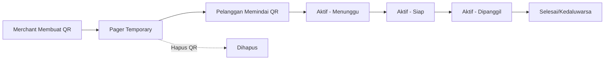
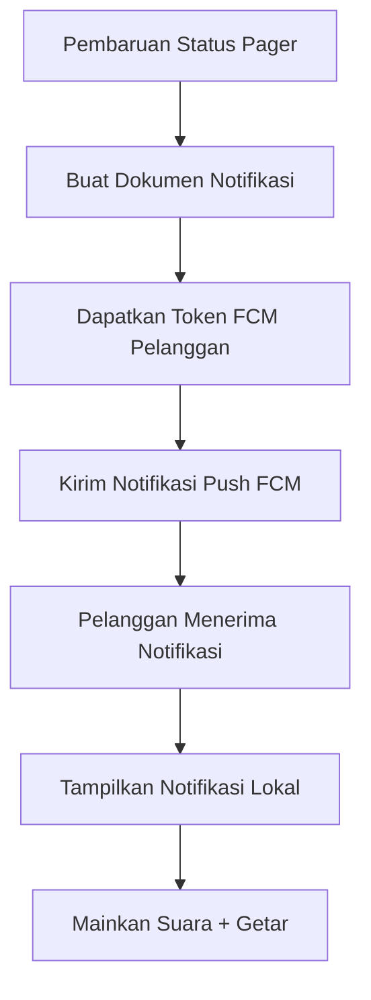
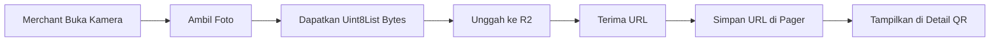

# Cammo - Sistem Pager Mobile


**Cammo** adalah sistem manajemen antrian mobile modern yang mendigitalisasi operasi antrian restoran dan layanan. Dibangun dengan Flutter dan didukung oleh Firebase, Cammo menyediakan manajemen pager real-time melalui kode QR, memungkinkan komunikasi yang mulus antara merchant dan pelanggan.

## 📱 Fitur

### Untuk Pelanggan
- **Pemindaian Kode QR**: Pindai kode QR yang dibuat merchant untuk bergabung ke antrian
- **Pembaruan Real-time**: Terima notifikasi push ketika pesanan siap
- **Mode Tamu**: Gunakan aplikasi tanpa registrasi (dengan penyimpanan lokal)
- **Google Sign-In**: Autentikasi cepat dengan akun Google
- **Riwayat Pesanan**: Lacak semua pesanan yang lalu dan aktif
- **Pelacakan Multi-status**: Pantau progres pesanan (menunggu → siap → dipanggil)

### Untuk Merchant
- **Pembuatan Pager**: Generate kode QR untuk pager fisik dengan foto struk opsional
- **Manajemen Antrian**: Pantau dan kontrol semua antrian pelanggan aktif
- **Kontrol Status**: Perbarui status pesanan dengan satu ketukan (siap, memanggil, selesai)
- **Analitik Pelanggan**: Lihat statistik pelanggan dan riwayat pesanan
- **Pengaturan yang Dapat Dikonfigurasi**: Auto-expire pesanan, interval panggilan, maksimal percobaan
- **Notifikasi Push**: Notifikasi otomatis ke pelanggan saat perubahan status
- **Dashboard Bisnis**: Analitik real-time (pesanan hari ini, tingkat penyelesaian, waktu tunggu rata-rata)

## 🛠 Stack Teknologi

### Frontend
- **Framework**: Flutter ^3.9.2
- **State Management**: Riverpod 2.4.0 (dengan code generation)
- **Arsitektur**: Clean Architecture (Feature-First)
- **Komponen UI**: Material Design 3
- **Font**: Google Fonts (Inter)
- **Ikon**: Iconsax Flutter
- **Desain Responsif**: Flutter ScreenUtil

### Backend & Services
- **Autentikasi**: Firebase Authentication (Google Sign-In, Anonymous)
- **Database**: Cloud Firestore (real-time)
- **Notifikasi Push**: Firebase Cloud Messaging (FCM)
- **Penyimpanan**: Cloudflare R2 (gambar struk)
- **Penyimpanan Lokal**: SQLite (persistensi pengguna tamu)

### Dependensi Utama
- `firebase_auth: ^5.3.1` - Autentikasi
- `cloud_firestore: ^5.4.4` - Database real-time
- `firebase_messaging: ^15.1.3` - Notifikasi push
- `google_sign_in: ^6.2.2` - Google OAuth
- `cloudflare_r2: ^0.0.14` - Penyimpanan gambar
- `sqflite: ^2.4.2` - Database lokal untuk tamu
- `mobile_scanner: ^7.1.3` - Pemindaian kode QR
- `pretty_qr_code: ^3.5.0` - Pembuatan kode QR
- `flutter_local_notifications: ^18.0.1` - Notifikasi lokal

---

## 📚 Dokumentasi API

### Daftar Isi
1. [API Autentikasi Firebase](#1-api-autentikasi-firebase)
2. [Skema Koleksi Firestore](#2-skema-koleksi-firestore)
3. [API Manajemen Pager](#3-api-manajemen-pager)
4. [API Sistem Notifikasi](#4-api-sistem-notifikasi)
5. [API Penyimpanan Cloudflare R2](#5-api-penyimpanan-cloudflare-r2)
6. [API Pengaturan Merchant](#6-api-pengaturan-merchant)
7. [API Analitik](#7-api-analitik)
8. [Stream Real-time](#8-stream-real-time)

---

## 1. API Autentikasi Firebase

### Gambaran Umum
Cammo mendukung tiga mode autentikasi: Google Sign-In untuk pelanggan, Google Sign-In wajib untuk merchant, dan autentikasi anonim untuk tamu dengan persistensi lokal.

### Repository Autentikasi
**Interface**: `lib/features/authentication/domain/repositories/i_auth_repository.dart`

#### Metode

##### `signInWithGoogle({required String role})`
Autentikasi pengguna dengan Google OAuth.

```dart
Future<UserModel> signInWithGoogle({required String role});
```

**Parameter:**
- `role` (String): `'customer'` atau `'merchant'`

**Mengembalikan:** `UserModel` dengan data pengguna yang terautentikasi

**Alur:**
1. Memulai Google Sign-In
2. Membuat/mengambil pengguna Firebase
3. Menyimpan profil pengguna di koleksi Firestore `users/`
4. Untuk merchant: memeriksa apakah profil merchant ada di koleksi `merchants/`
5. Menyimpan token FCM untuk notifikasi push

**Contoh Penggunaan:**
```dart
final authRepo = ref.read(authRepositoryProvider);
final user = await authRepo.signInWithGoogle(role: 'customer');
```

##### `signInAsGuest()`
Membuat pengguna anonim dengan persistensi lokal.

```dart
Future<UserModel> signInAsGuest();
```

**Mengembalikan:** `UserModel` dengan kredensial tamu

**Alur:**
1. Membuat pengguna anonim Firebase
2. Menghasilkan UID tamu yang unik
3. Menyimpan UID secara lokal via SQLite (`guest_storage.db`)
4. Mengasosiasikan dengan ID perangkat
5. Menetapkan masa berlaku 30 hari
6. Membuat dokumen pengguna di Firestore

**Guest Storage Service**: `lib/core/services/guest_storage_service.dart`

```dart
// Skema SQLite
CREATE TABLE guest_users (
  id INTEGER PRIMARY KEY AUTOINCREMENT,
  guestUid TEXT NOT NULL UNIQUE,
  deviceId TEXT NOT NULL,
  createdAt TEXT NOT NULL,
  expiresAt TEXT NOT NULL
);
```

##### `signOut()`
Keluar dari pengguna saat ini dan hapus sesi.

```dart
Future<void> signOut();
```

**Alur:**
1. Menghapus token FCM dari Firestore
2. Menghapus penyimpanan tamu lokal (jika tamu)
3. Keluar dari Firebase Auth
4. Menghapus state Riverpod

##### `getUserData(String uid)`
Mengambil profil pengguna dari Firestore.

```dart
Future<UserModel?> getUserData(String uid);
```

**Parameter:**
- `uid` (String): ID pengguna Firebase

**Mengembalikan:** `UserModel` atau `null` jika tidak ditemukan

##### `updateUserProfile()`
Memperbarui nama tampilan dan URL foto pengguna.

```dart
Future<void> updateUserProfile({
  required String uid,
  String? displayName,
  String? photoURL,
});
```

##### `deleteAccount()`
Hapus akun pengguna dan semua data terkait secara permanen.

```dart
Future<void> deleteAccount();
```

**Penghapusan Cascade:**
- Dokumen pengguna dari koleksi `users/`
- Profil merchant dari `merchants/` (jika merchant)
- Semua pager yang dibuat (temporary dan aktif)
- Riwayat notifikasi
- Record penyimpanan tamu

### Skema UserModel

```dart
class UserModel {
  final String uid;              // ID pengguna Firebase
  final String email;            // Email pengguna (kosong untuk tamu)
  final String displayName;      // Nama tampilan atau "Guest User"
  final String? photoURL;        // URL foto profil
  final String role;             // 'customer', 'merchant', atau 'guest'
  final String provider;         // 'google', 'anonymous'
  final bool isMerchant;         // Computed: role == 'merchant'
  final bool isGuest;            // Computed: role == 'guest'
  final DateTime createdAt;      // Timestamp pembuatan akun
  final DateTime? updatedAt;     // Update profil terakhir
}
```

**Path Firestore:** `users/{uid}`

---

## 2. Skema Koleksi Firestore

### Gambaran Umum
Cammo menggunakan Cloud Firestore untuk sinkronisasi data real-time. Semua koleksi menerapkan aturan keamanan untuk memastikan pengguna hanya dapat mengakses data mereka sendiri.

### Koleksi: `users`
**Path:** `users/{uid}`

Menyimpan profil pengguna untuk semua tipe autentikasi.

**Field:**
```dart
{
  "uid": String,              // ID pengguna Firebase (ID dokumen)
  "email": String,            // Email pengguna (kosong untuk tamu)
  "displayName": String,      // Nama tampilan
  "photoURL": String?,        // URL foto profil
  "role": String,             // 'customer', 'merchant', 'guest'
  "provider": String,         // 'google', 'anonymous'
  "fcmToken": String?,        // Token Firebase Cloud Messaging
  "deviceId": String?,        // Identifikasi perangkat (untuk tamu)
  "createdAt": Timestamp,     // Pembuatan akun
  "updatedAt": Timestamp?,    // Update terakhir
  "expiresAt": Timestamp?     // Masa berlaku (hanya tamu, 30 hari)
}
```

**Aturan Keamanan:**
```javascript
match /users/{userId} {
  allow read, write: if request.auth != null && request.auth.uid == userId;
}
```

---

### Koleksi: `merchants`
**Path:** `merchants/{merchantId}`

Menyimpan profil bisnis merchant dan pengaturan.

**Field:**
```dart
{
  "merchantId": String,           // ID pengguna merchant
  "merchantName": String,         // Nama bisnis
  "merchantLocation": String?,    // Alamat/lokasi bisnis
  "email": String,                // Email merchant
  "photoURL": String?,            // Logo bisnis
  "createdAt": Timestamp,         // Pembuatan profil
  "updatedAt": Timestamp?,        // Update pengaturan terakhir
  
  // Pengaturan
  "autoExpireOrders": bool,       // Auto-expire diaktifkan (default: false)
  "expireAfterHours": int,        // Jam sampai auto-expire (default: 2)
  "maxRingingAttempts": int,      // Maksimal percobaan panggilan (default: 3)
  "ringingIntervalMinutes": int,  // Menit antar panggilan (default: 5)
  "ringingDurationSeconds": int,  // Durasi setiap panggilan (default: 30)
  "requireLocation": bool,        // Memerlukan lokasi pelanggan (default: false)
  "requireCustomerInfo": bool     // Memerlukan detail pelanggan (default: false)
}
```

**Aturan Keamanan:**
```javascript
match /merchants/{merchantId} {
  allow read: if request.auth != null;
  allow write: if request.auth != null && request.auth.uid == merchantId;
}
```

---

### Koleksi: `temporary_pagers`
**Path:** `temporary_pagers/{pagerId}`

Kode QR yang dibuat oleh merchant tetapi belum dipindai oleh pelanggan.

**Field:**
```dart
{
  "id": String,                   // ID dokumen
  "pagerId": String,              // Sama dengan ID dokumen
  "merchantId": String,           // ID merchant pembuat
  "number": int,                  // Nomor pager berurutan (mis., 1, 2, 3...)
  "randomCode": String,           // Kode tampilan aman 6 digit
  "status": String,               // Selalu 'temporary'
  "label": String?,               // Deskripsi opsional (mis., "Meja 5")
  "notes": String?,               // Catatan merchant
  "invoiceImageUrl": String?,     // URL Cloudflare R2 untuk foto struk
  "metadata": Map<String, dynamic>?, // Data kustom tambahan
  "createdAt": Timestamp,         // Waktu pembuatan kode QR
  "expiresAt": Timestamp?         // Masa berlaku opsional (default: tidak ada)
}
```

**Format JSON Kode QR:**
```json
{
  "pagerId": "abc123xyz",
  "merchantId": "merchant_uid_here",
  "number": 42
}
```

**Aturan Keamanan:**
```javascript
match /temporary_pagers/{pagerId} {
  allow read: if request.auth != null;
  allow create, update, delete: if request.auth != null && 
    request.resource.data.merchantId == request.auth.uid;
}
```

---

### Koleksi: `active_pagers`
**Path:** `active_pagers/{pagerId}`

Item antrian aktif setelah pelanggan memindai kode QR.

**Field:**
```dart
{
  "id": String,                   // ID dokumen
  "pagerId": String,              // Sama dengan ID dokumen
  "merchantId": String,           // ID merchant
  "customerId": String,           // ID pengguna pelanggan/tamu
  "customerType": String,         // 'customer', 'guest'
  "number": int,                  // Nomor pager asli
  "queueNumber": int,             // Posisi antrian (1, 2, 3...)
  "randomCode": String,           // Kode tampilan 6 digit
  "status": String,               // 'waiting', 'ready', 'ringing', 'finished', 'expired'
  "label": String?,               // Deskripsi pager
  "notes": String?,               // Catatan merchant
  "invoiceImageUrl": String?,     // URL foto struk
  "metadata": Map<String, dynamic>?, // Data kustom
  "scannedBy": Map<String, dynamic>, // Info pelanggan
  "createdAt": Timestamp,         // Waktu pembuatan asli
  "activatedAt": Timestamp,       // Saat pelanggan memindai
  "finishedAt": Timestamp?,       // Waktu penyelesaian
  "expiresAt": Timestamp?,        // Waktu kedaluwarsa
  "ringingCount": int,            // Jumlah panggilan terkirim (default: 0)
}
```

**Objek `scannedBy`:**
```dart
{
  "customerId": String,
  "customerName": String,
  "customerEmail": String?,
  "customerType": String,  // 'customer', 'guest'
  "photoURL": String?
}
```

**Siklus Hidup Status:**
```
temporary → waiting → ready → ringing → finished/expired
            └─────────────────────────────┘
              (merchant dapat melakukan transisi)
```

**Aturan Keamanan:**
```javascript
match /active_pagers/{pagerId} {
  allow read: if request.auth != null && (
    request.auth.uid == resource.data.merchantId ||
    request.auth.uid == resource.data.customerId
  );
  allow create: if request.auth != null;
  allow update: if request.auth != null && 
    request.auth.uid == resource.data.merchantId;
  allow delete: if request.auth != null && 
    request.auth.uid == resource.data.merchantId;
}
```

---

### Koleksi: `notifications`
**Path:** `notifications/{notificationId}`

Riwayat notifikasi push untuk audit dan pelacakan yang belum dibaca.

**Field:**
```dart
{
  "id": String,                   // ID dokumen
  "userId": String,               // ID pengguna penerima
  "type": String,                 // Tipe notifikasi (lihat enum di bawah)
  "title": String,                // Judul notifikasi
  "body": String,                 // Teks isi notifikasi
  "pagerId": String?,             // ID pager terkait
  "merchantId": String?,          // ID merchant terkait
  "data": Map<String, dynamic>?,  // Payload tambahan
  "isRead": bool,                 // Status baca (default: false)
  "createdAt": Timestamp          // Timestamp notifikasi
}
```

**Tipe Notifikasi:**
```dart
enum NotificationType {
  newCustomer,       // Ke merchant: pelanggan baru bergabung antrian
  orderReady,        // Ke pelanggan: status pesanan → siap
  orderCalling,      // Ke pelanggan: status pesanan → dipanggil
  orderExpiringSoon, // Ke pelanggan: pesanan akan segera kedaluwarsa
  orderExpired,      // Ke pelanggan: pesanan kedaluwarsa
  orderFinished      // Ke pelanggan: pesanan selesai
}
```

**Aturan Keamanan:**
```javascript
match /notifications/{notificationId} {
  allow read, update: if request.auth != null && 
    request.auth.uid == resource.data.userId;
  allow create: if request.auth != null;
}
```

---

## 3. API Manajemen Pager

### Gambaran Umum
API Manajemen Pager menangani siklus hidup lengkap item antrian, dari pembuatan kode QR hingga penyelesaian pesanan.

### Repository Pager
**Interface**: `lib/features/pager/domain/repositories/i_pager_repository.dart`

**Implementasi**: `lib/features/pager/data/repositories/pager_repository.dart`

### Siklus Hidup Pager



### Metode Repository

#### `createTemporaryPager()`
Membuat pager kode QR baru (belum diaktifkan).

```dart
Future<String> createTemporaryPager({
  required String merchantId,
  String? label,
  String? invoiceImageUrl,
  Map<String, dynamic>? metadata,
});
```

**Parameter:**
- `merchantId` (String): ID merchant pembuat
- `label` (String, opsional): Deskripsi (mis., "Meja 5", "Pesanan #123")
- `invoiceImageUrl` (String, opsional): URL Cloudflare R2 untuk gambar struk
- `metadata` (Map, opsional): Data key-value kustom

**Mengembalikan:** `pagerId` (String) - ID dokumen pager yang dibuat

**Alur:**
1. Menghasilkan nomor pager berurutan (query nomor max + 1)
2. Membuat kode acak 6 digit untuk tampilan
3. Membuat dokumen di koleksi `temporary_pagers/`
4. Mengembalikan `pagerId` untuk pembuatan kode QR

**Contoh:**
```dart
final pagerRepo = ref.read(pagerRepositoryProvider);
final pagerId = await pagerRepo.createTemporaryPager(
  merchantId: currentUser.uid,
  label: 'Meja 8',
  invoiceImageUrl: 'https://r2.cloudflarestorage.com/...',
);

// Generate kode QR dengan data ini:
final qrData = jsonEncode({
  'pagerId': pagerId,
  'merchantId': currentUser.uid,
  'number': pagerNumber,
});
```

---

#### `activatePager()`
Mengaktifkan pager temporary ketika pelanggan memindai kode QR.

```dart
Future<void> activatePager({
  required String pagerId,
  required String customerId,
  required String customerType,
  required Map<String, dynamic> customerInfo,
});
```

**Parameter:**
- `pagerId` (String): ID dokumen pager dari kode QR
- `customerId` (String): ID pengguna pelanggan/tamu
- `customerType` (String): `'customer'` atau `'guest'`
- `customerInfo` (Map): Detail pelanggan untuk field `scannedBy`

**Alur:**
1. Mengambil pager temporary dari `temporary_pagers/{pagerId}`
2. Memvalidasi pager ada dan masih temporary
3. Menghasilkan nomor antrian (menghitung pager aktif untuk merchant + 1)
4. Memindahkan data ke `active_pagers/{pagerId}` dengan status `'waiting'`
5. Menghapus aslinya dari `temporary_pagers/`
6. Mengirim notifikasi `newCustomer` ke merchant

**Format Info Pelanggan:****
```dart
{
  "customerId": "user_123",
  "customerName": "John Doe",
  "customerEmail": "john@example.com",
  "customerType": "customer",
  "photoURL": "https://..."
}
```

**Contoh:**
```dart
await pagerRepo.activatePager(
  pagerId: scannedPageId,
  customerId: currentUser.uid,
  customerType: currentUser.role,
  customerInfo: {
    'customerId': currentUser.uid,
    'customerName': currentUser.displayName,
    'customerEmail': currentUser.email,
    'customerType': currentUser.role,
    'photoURL': currentUser.photoURL,
  },
);
```

---

#### `updatePagerStatus()`
Memperbarui status pager aktif (hanya merchant).

```dart
Future<void> updatePagerStatus({
  required String pagerId,
  required String status,
});
```

**Parameter:**
- `pagerId` (String): ID pager aktif
- `status` (String): Status baru (`'waiting'`, `'ready'`, `'ringing'`, `'finished'`, `'expired'`)

**Transisi Status:**
- `waiting` → `ready`: Pesanan sudah disiapkan
- `ready` → `ringing`: Pelanggan sedang dipanggil
- `ringing` → `ringing`: Increment `ringingCount`
- `ringing` → `finished`: Pelanggan mengambil pesanan
- Apapun → `expired`: Pesanan kedaluwarsa (otomatis atau manual)

**Efek Samping:**
- Memperbarui `finishedAt` ketika status → `finished` atau `expired`
- Mengirim notifikasi yang sesuai ke pelanggan:
  - `ready` → `orderReady`
  - `ringing` → `orderCalling`
  - `finished` → `orderFinished`
  - `expired` → `orderExpired`

**Contoh:**
```dart
await pagerRepo.updatePagerStatus(
  pagerId: 'pager_abc',
  status: 'ready',
);
// Pelanggan menerima notifikasi push "orderReady"
```

---

#### `updatePagerNotes()`
Memperbarui catatan merchant pada pager aktif.

```dart
Future<void> updatePagerNotes({
  required String pagerId,
  required String notes,
});
```

---

#### `deleteTemporaryPager()`
Menghapus pager temporary (kode QR) sebelum aktivasi.

```dart
Future<void> deleteTemporaryPager(String pagerId);
```

**Catatan:** Tidak dapat menghapus pager aktif - harus memperbarui status ke `finished` atau `expired` sebagai gantinya.

---

#### `getPagerById()`
Mengambil satu pager berdasarkan ID.

```dart
Future<PagerModel?> getPagerById(String pagerId);
```

**Mengembalikan:** `PagerModel` atau `null` jika tidak ditemukan

**Urutan Pencarian:**
1. Memeriksa `active_pagers/{pagerId}`
2. Fallback ke `temporary_pagers/{pagerId}`

---

#### Metode Stream (Real-time)

##### `watchTemporaryPagers()`
Stream pager temporary untuk merchant.

```dart
Stream<List<PagerModel>> watchTemporaryPagers(String merchantId);
```

**Mengembalikan:** List real-time kode QR yang belum dipindai

---

##### `watchActivePagers()`
Stream pager aktif untuk merchant.

```dart
Stream<List<PagerModel>> watchActivePagers(String merchantId);
```

**Mengembalikan:** List real-time item antrian aktif (semua status kecuali temporary)

---

##### `getCustomerActivePagers()`
Stream pager aktif untuk pelanggan.

```dart
Stream<List<PagerModel>> getCustomerActivePagers(String customerId);
```

**Mengembalikan:** Pesanan aktif pelanggan (waiting, ready, ringing)

---

##### `getMerchantHistoryPagers()`
Stream pager selesai untuk merchant.

```dart
Stream<List<PagerModel>> getMerchantHistoryPagers(String merchantId);
```

**Mengembalikan:** Pager dengan status `finished` atau `expired`

---

##### `getCustomerHistoryPagers()`
Stream pager selesai untuk pelanggan.

```dart
Stream<List<PagerModel>> getCustomerHistoryPagers(String customerId);
```

---

#### Analitik Pelanggan

##### `getCustomerStatsList()`
Mendapatkan daftar semua pelanggan dengan statistik pesanan.

```dart
Future<List<CustomerStatsModel>> getCustomerStatsList(String merchantId);
```

**Mengembalikan:** Daftar pelanggan (non-tamu) dengan:
- Total pesanan
- Waktu tunggu rata-rata
- Tanggal pesanan terakhir

**CustomerStatsModel:**
```dart
class CustomerStatsModel {
  final String customerId;
  final String customerName;
  final String customerEmail;
  final int totalOrders;
  final int averageWaitMinutes;
  final DateTime? lastOrderDate;
}
```

---

##### `getCustomerPagerHistory()`
Mendapatkan riwayat pesanan untuk pelanggan tertentu.

```dart
Future<List<PagerModel>> getCustomerPagerHistory({
  required String merchantId,
  required String customerId,
});
```

**Parameter:**
- `merchantId` (String): ID merchant
- `customerId` (String): ID pelanggan untuk mengambil riwayat

**Mengembalikan:** Daftar semua pager (aktif + riwayat) untuk pelanggan tersebut

---

## 4. API Sistem Notifikasi

### Gambaran Umum
Cammo menggunakan Firebase Cloud Messaging (FCM) untuk notifikasi push dan Flutter Local Notifications untuk alert dalam aplikasi.

### Service Notifikasi
**Implementasi**: `lib/core/services/notification_service.dart`

### Alur Notifikasi



### Tipe Notifikasi

```dart
enum NotificationType {
  newCustomer,       // Merchant: Pelanggan bergabung antrian
  orderReady,        // Pelanggan: Pesanan siap diambil
  orderCalling,      // Pelanggan: Merchant memanggil Anda (ringing)
  orderExpiringSoon, // Pelanggan: Pesanan kedaluwarsa dalam X menit
  orderExpired,      // Pelanggan: Pesanan telah kedaluwarsa
  orderFinished      // Pelanggan: Pesanan ditandai selesai
}
```

### Repository Notifikasi
**Interface**: `lib/features/notification/domain/repositories/i_notification_repository.dart`

#### Metode

##### `createNotification()`
Membuat record notifikasi dan mengirim push FCM.

```dart
Future<void> createNotification(NotificationModel notification);
```

**NotificationModel:**
```dart
class NotificationModel {
  final String id;
  final String userId;          // ID pengguna penerima
  final NotificationType type;
  final String title;
  final String body;
  final String? pagerId;
  final String? merchantId;
  final Map<String, dynamic>? data;
  final bool isRead;
  final DateTime createdAt;
}
```

**Alur:**
1. Membuat dokumen di `notifications/{notificationId}`
2. Mengambil token FCM pengguna dari `users/{userId}`
3. Mengirim HTTP POST ke endpoint FCM (via Cloud Functions - placeholder)
4. Pelanggan menerima notifikasi push
5. Notifikasi lokal ditampilkan dengan suara dan getaran kustom

**Contoh:**
```dart
final notificationRepo = ref.read(notificationRepositoryProvider);
await notificationRepo.createNotification(
  NotificationModel(
    id: 'notif_123',
    userId: customerId,
    type: NotificationType.orderReady,
    title: 'Pesanan Siap!',
    body: 'Pesanan Anda #42 siap diambil',
    pagerId: pagerId,
    merchantId: merchantId,
    isRead: false,
    createdAt: DateTime.now(),
  ),
);
```

---

##### `watchNotifications()`
Stream notifikasi pengguna (real-time).

```dart
Stream<List<NotificationModel>> watchNotifications(String userId);
```

**Mengembalikan:** List real-time notifikasi, diurutkan berdasarkan tanggal pembuatan (terbaru pertama)

---

##### `markAsRead()`
Tandai satu notifikasi sebagai sudah dibaca.

```dart
Future<void> markAsRead(String notificationId);
```

---

##### `markAllAsRead()`
Tandai semua notifikasi pengguna sebagai sudah dibaca.

```dart
Future<void> markAllAsRead(String userId);
```

---

##### `getUnreadCount()`
Mendapatkan jumlah notifikasi yang belum dibaca.

```dart
Future<int> getUnreadCount(String userId);
```

**Mengembalikan:** Jumlah notifikasi dengan `isRead == false`

---

##### Manajemen Token FCM

##### `getFCMToken()`
Mengambil token FCM perangkat pengguna.

```dart
Future<String?> getFCMToken(String userId);
```

**Mengembalikan:** String token FCM atau `null`

---

##### `saveFCMToken()`
Menyimpan token FCM ke dokumen pengguna.

```dart
Future<void> saveFCMToken(String userId, String token);
```

**Dipanggil otomatis pada:**
- Sign-in pengguna
- Inisialisasi aplikasi
- Refresh token

---

### Setup Notifikasi Lokal

**Service**: `lib/core/services/notification_service.dart`

**Konfigurasi:**
- **Android**: `notification_sound.mp3` di `android/app/src/main/res/raw/`
- **iOS**: `notification_sound.aiff` di `ios/Runner/Resources/`
- **Pola Getaran**: `[0, 500, 200, 500]` (jeda, getar, jeda, getar)

**Notification Channels (Android):**
```dart
AndroidNotificationChannel(
  'order_updates',
  'Pembaruan Pesanan',
  description: 'Notifikasi untuk perubahan status pesanan',
  importance: Importance.high,
  playSound: true,
  sound: RawResourceAndroidNotificationSound('notification_sound'),
  enableVibration: true,
  vibrationPattern: Int64List.fromList([0, 500, 200, 500]),
);
```

---

### Penanganan Pesan FCM

**Background Handler**: `lib/main.dart`

```dart
@pragma('vm:entry-point')
Future<void> _firebaseMessagingBackgroundHandler(RemoteMessage message) async {
  await Firebase.initializeApp(options: DefaultFirebaseOptions.currentPlatform);
  // Proses data notifikasi
  // Tampilkan notifikasi lokal
}
```

**Foreground Handler**: Terdaftar di `NotificationService.initialize()`

```dart
FirebaseMessaging.onMessage.listen((RemoteMessage message) {
  // Tampilkan notifikasi lokal saat aplikasi terbuka
  _showLocalNotification(message);
});
```

---

## 5. API Penyimpanan Cloudflare R2

### Gambaran Umum
Cammo menggunakan Cloudflare R2 untuk menyimpan gambar struk/invoice yang diunggah oleh merchant saat membuat pager.

### Service Cloudflare
**Implementasi**: `lib/core/services/cloudflare_service.dart`

### Setup

#### Variabel Environment
Buat file `.env` di root proyek:

```env
CLOUDFLARE_ACCOUNT_ID=your_account_id_here
CLOUDFLARE_ACCESS_KEY_ID=your_access_key_here
CLOUDFLARE_SECRET_ACCESS_KEY=your_secret_key_here
CLOUDFLARE_BUCKET_NAME=your_bucket_name_here
```

**Muat di aplikasi:**
```dart
await dotenv.load(fileName: ".env");
```

---

### Metode

#### `uploadImage()`
Unggah gambar ke bucket Cloudflare R2.

```dart
Future<String> uploadImage(
  Uint8List imageBytes, {
  String? fileName,
});
```

**Parameter:**
- `imageBytes` (Uint8List): Data biner gambar
- `fileName` (String, opsional): Nama file kustom (default: auto-generated dengan timestamp)

**Mengembalikan:** URL publik ke gambar yang diunggah

**Alur:**
1. Memvalidasi bytes gambar tidak kosong
2. Menghasilkan nama file: `receipt_${merchantId}_${timestamp}.jpg`
3. Mengunggah ke bucket R2 menggunakan Cloudflare R2 SDK
4. Mengembalikan URL publik: `https://{bucket}.r2.cloudflarestorage.com/{fileName}`

**Contoh:**
```dart
// Ambil gambar dari kamera
final XFile photo = await controller.takePicture();
final Uint8List imageBytes = await photo.readAsBytes();

// Unggah ke R2
final cloudflareService = ref.read(cloudflareServiceProvider);
final imageUrl = await cloudflareService.uploadImage(
  imageBytes,
  fileName: 'receipt_table5_${DateTime.now().millisecondsSinceEpoch}.jpg',
);

// Gunakan dalam pembuatan pager
await pagerRepo.createTemporaryPager(
  merchantId: merchantId,
  label: 'Meja 5',
  invoiceImageUrl: imageUrl,
);
```

---

#### `deleteImage()`
Hapus gambar dari bucket R2.

```dart
Future<void> deleteImage(String objectName);
```

**Parameter:**
- `objectName` (String): Nama file di bucket (bukan URL lengkap)

**Contoh:**
```dart
// Ekstrak nama file dari URL
final url = 'https://bucket.r2.cloudflarestorage.com/receipt_123.jpg';
final fileName = url.split('/').last; // 'receipt_123.jpg'

await cloudflareService.deleteImage(fileName);
```

**Catatan:** Gambar biasanya tidak dihapus secara otomatis ketika pager dihapus. Implementasikan logika pembersihan jika diperlukan.

---

### URL Presigned

Cloudflare R2 secara otomatis menghasilkan URL presigned dengan validitas 7 hari. Tidak perlu konfigurasi tambahan.

**Format URL:**
```
https://{bucket_name}.r2.cloudflarestorage.com/{object_name}
```

---

### Alur Pengambilan Gambar



**Implementasi**: `lib/features/pager/presentation/pages/camera_page.dart`

---

## 6. API Pengaturan Merchant

### Gambaran Umum
Merchant dapat mengkonfigurasi aturan bisnis untuk kedaluwarsa pesanan otomatis, perilaku panggilan, dan persyaratan informasi pelanggan.

### Repository Pengaturan Merchant
**Interface**: `lib/features/merchant/domain/repositories/i_merchant_settings_repository.dart`

### MerchantSettingsModel

```dart
class MerchantSettingsModel {
  final String merchantId;
  final String merchantName;
  final String? merchantLocation;
  
  // Auto-expiration
  final bool autoExpireOrders;        // Default: false
  final int expireAfterHours;         // Default: 2 jam
  
  // Perilaku panggilan
  final int maxRingingAttempts;       // Default: 3 percobaan
  final int ringingIntervalMinutes;   // Default: 5 menit antar panggilan
  final int ringingDurationSeconds;   // Default: 30 detik per panggilan
  
  // Persyaratan pelanggan
  final bool requireLocation;         // Default: false
  final bool requireCustomerInfo;     // Default: false
}
```

**Path Firestore:** `merchants/{merchantId}`

---

### Metode Repository

#### `getMerchantSettings()`
Mengambil pengaturan merchant (pembacaan satu kali).

```dart
Future<MerchantSettingsModel> getMerchantSettings(String merchantId);
```

**Mengembalikan:** `MerchantSettingsModel` dengan pengaturan saat ini

**Nilai Default:** Jika dokumen merchant tidak ada, mengembalikan pengaturan dengan nilai default.

---

#### `updateMerchantSettings()`
Memperbarui pengaturan merchant.

```dart
Future<void> updateMerchantSettings(MerchantSettingsModel settings);
```

**Contoh:**
```dart
final settingsRepo = ref.read(merchantSettingsRepositoryProvider);
await settingsRepo.updateMerchantSettings(
  MerchantSettingsModel(
    merchantId: merchantId,
    merchantName: 'Kedai Kopi',
    merchantLocation: 'Jl. Utama No. 123',
    autoExpireOrders: true,
    expireAfterHours: 3,
    maxRingingAttempts: 5,
    ringingIntervalMinutes: 10,
    ringingDurationSeconds: 45,
    requireLocation: false,
    requireCustomerInfo: true,
  ),
);
```

---

#### `watchMerchantSettings()`
Stream pengaturan merchant (real-time).

```dart
Stream<MerchantSettingsModel> watchMerchantSettings(String merchantId);
```

**Mengembalikan:** Pembaruan real-time ketika pengaturan berubah

---

### Logika Bisnis Pengaturan

#### Auto-Expiration
Ketika `autoExpireOrders == true`:
1. Pager `expiresAt` dihitung: `activatedAt + expireAfterHours`
2. Service latar belakang memantau pager aktif
3. Ketika waktu saat ini melebihi `expiresAt`:
   - Status diperbarui ke `'expired'`
   - Notifikasi `orderExpired` dikirim ke pelanggan
   - Pager dipindahkan ke riwayat

#### Percobaan Panggilan
Ketika merchant mengatur status ke `'ringing'`:
1. Increment `ringingCount` pada pager
2. Jika `ringingCount >= maxRingingAttempts`:
   - Tampilkan peringatan ke merchant
   - Opsional auto-expire pager
3. Pelanggan menerima notifikasi `orderCalling`
4. Merchant menunggu `ringingIntervalMinutes` sebelum percobaan berikutnya

---

## 7. API Analitik

### Gambaran Umum
Analitik bisnis real-time untuk merchant yang menampilkan pesanan hari ini, performa mingguan, waktu tunggu rata-rata, dan tingkat penyelesaian.

### Repository Analitik
**Interface**: `lib/features/analytics/domain/repositories/i_analytics_repository.dart`

### AnalyticsModel

```dart
class AnalyticsModel {
  final int todayPagers;              // Pesanan dibuat hari ini
  final int weeklyPagers;             // Pesanan dalam 7 hari terakhir
  final int averageWaitSeconds;       // Rata-rata (finishedAt - activatedAt)
  final double completionRate;        // Selesai / (Selesai + Kedaluwarsa)
  
  // Computed property
  String get formattedWaitTime {
    final minutes = (averageWaitSeconds / 60).floor();
    if (minutes < 60) return '$minutes mnt';
    final hours = (minutes / 60).floor();
    final remainingMinutes = minutes % 60;
    return '${hours}j ${remainingMinutes}m';
  }
}
```

---

### Metode Repository

#### `watchMerchantAnalytics()`
Stream analitik real-time untuk merchant.

```dart
Stream<AnalyticsModel> watchMerchantAnalytics(String merchantId);
```

**Mengembalikan:** Analitik real-time yang diperbarui saat pesanan berubah

**Logika Perhitungan:**
1. **Pager Hari Ini**: Hitung aktif + selesai/kedaluwarsa dengan `createdAt` hari ini
2. **Pager Mingguan**: Hitung semua pager dalam 7 hari terakhir
3. **Waktu Tunggu Rata-rata**: 
   ```dart
   sum(finishedAt - activatedAt untuk semua pager selesai) / total selesai
   ```
4. **Tingkat Penyelesaian**:
   ```dart
   (jumlah selesai / (jumlah selesai + kedaluwarsa)) * 100
   ```

**Contoh Penggunaan:**
```dart
final analyticsRepo = ref.read(analyticsRepositoryProvider);
final analyticsStream = analyticsRepo.watchMerchantAnalytics(merchantId);

analyticsStream.listen((analytics) {
  print('Hari Ini: ${analytics.todayPagers}');
  print('Minggu Ini: ${analytics.weeklyPagers}');
  print('Tunggu Rata-rata: ${analytics.formattedWaitTime}');
  print('Penyelesaian: ${analytics.completionRate.toStringAsFixed(1)}%');
});
```

---

## 8. Stream Real-time

### Gambaran Umum
Cammo memanfaatkan stream real-time Firestore untuk pembaruan UI instan ketika data berubah.

### Pager Status Listener
**Implementasi**: `lib/features/pager/presentation/notifiers/pager_status_listener.dart`

**Tujuan:** Memperkaya data pager dengan nama merchant secara real-time.

```dart
Stream<List<PagerWithMerchantName>> watchPagersWithMerchantNames({
  required String customerId,
  required PagerRepository pagerRepo,
  required AuthRepository authRepo,
});
```

**Alur:**
1. Memantau stream pager aktif pelanggan
2. Untuk setiap pager, mengambil nama merchant dari `users/{merchantId}`
3. Menggabungkan ke objek `PagerWithMerchantName`:
   ```dart
   class PagerWithMerchantName {
     final PagerModel pager;
     final String merchantName;
   }
   ```
4. Memperbarui UI ketika:
   - Pager baru ditambahkan
   - Status pager berubah
   - Merchant memperbarui nama mereka

---

### Stream Provider (Riverpod)

#### Stream Pager Aktif (Pelanggan)
```dart
final customerActivePagersProvider = StreamProvider.autoDispose<List<PagerModel>>((ref) {
  final customerId = ref.watch(currentUserProvider)?.uid;
  if (customerId == null) return Stream.value([]);
  
  final pagerRepo = ref.watch(pagerRepositoryProvider);
  return pagerRepo.getCustomerActivePagers(customerId);
});
```

#### Stream Pager Aktif Merchant
```dart
final merchantActivePagersProvider = StreamProvider.autoDispose<List<PagerModel>>((ref) {
  final merchantId = ref.watch(currentUserProvider)?.uid;
  if (merchantId == null) return Stream.value([]);
  
  final pagerRepo = ref.watch(pagerRepositoryProvider);
  return pagerRepo.watchActivePagers(merchantId);
});
```

#### Stream Notifikasi
```dart
final notificationsProvider = StreamProvider.autoDispose<List<NotificationModel>>((ref) {
  final userId = ref.watch(currentUserProvider)?.uid;
  if (userId == null) return Stream.value([]);
  
  final notificationRepo = ref.watch(notificationRepositoryProvider);
  return notificationRepo.watchNotifications(userId);
});
```

#### Stream Jumlah Belum Dibaca
```dart
final unreadCountProvider = StreamProvider.autoDispose<int>((ref) {
  final notifications = ref.watch(notificationsProvider).value ?? [];
  return Stream.value(notifications.where((n) => !n.isRead).length);
});
```

---

## 🚀 Memulai

### Prasyarat
- **Flutter SDK**: ^3.9.2 atau lebih tinggi
- **Dart SDK**: ^3.0.0 atau lebih tinggi
- **Proyek Firebase**: Buat di [Firebase Console](https://console.firebase.google.com/)
- **Akun Cloudflare**: Untuk penyimpanan R2 (opsional untuk gambar struk)
- **Android Studio** atau **VS Code** dengan ekstensi Flutter

---

### Instalasi

#### 1. Clone Repository
```bash
git clone https://github.com/Squad-Qwat/Mobile-Pager_Flutter.git
cd Mobile-Pager_Flutter
```

#### 2. Install Dependensi
```bash
flutter pub get
```

#### 3. Setup Firebase

##### a. Buat Proyek Firebase
1. Pergi ke [Firebase Console](https://console.firebase.google.com/)
2. Buat proyek baru atau gunakan yang sudah ada
3. Aktifkan **Authentication** (Google Sign-In, Anonymous)
4. Aktifkan **Cloud Firestore**
5. Aktifkan **Cloud Messaging**

##### b. Tambahkan Firebase ke Aplikasi Flutter

**Untuk Android:**
1. Download `google-services.json`
2. Letakkan di `android/app/`

**Untuk iOS:**
1. Download `GoogleService-Info.plist`
2. Letakkan di `ios/Runner/`

**Untuk Web:**
1. Salin konfigurasi web dari Firebase Console
2. Perbarui `web/index.html`

##### c. Generate Firebase Options
```bash
flutterfire configure
```

Ini akan membuat/memperbarui `lib/firebase_options.dart`.

##### d. Aturan Keamanan Firestore
Salin aturan dari `firestore.rules` ke Firebase Console:
```bash
firebase deploy --only firestore:rules
```

##### e. Indeks Firestore
Deploy indeks dari `firestore.indexes.json`:
```bash
firebase deploy --only firestore:indexes
```

---

#### 4. Konfigurasi Environment

Buat file `.env` di root proyek:
```env
# Konfigurasi Cloudflare R2 (opsional - untuk gambar struk)
CLOUDFLARE_ACCOUNT_ID=your_account_id
CLOUDFLARE_ACCESS_KEY_ID=your_access_key
CLOUDFLARE_SECRET_ACCESS_KEY=your_secret_key
CLOUDFLARE_BUCKET_NAME=your_bucket_name
```

**Catatan:** Jika Anda melewati setup Cloudflare, fitur unggah gambar akan dinonaktifkan.

---

#### 5. Setup Google Sign-In

##### Android
1. Dapatkan fingerprint sertifikat SHA-1:
   ```bash
   cd android
   ./gradlew signingReport
   ```
2. Tambahkan SHA-1 ke Firebase Console → Project Settings → Your Apps → Android App
3. Download `google-services.json` yang baru

##### iOS
1. Buka `ios/Runner/Info.plist`
2. Tambahkan URL scheme dari `GoogleService-Info.plist`:
   ```xml
   <key>CFBundleURLTypes</key>
   <array>
     <dict>
       <key>CFBundleURLSchemes</key>
       <array>
         <string>com.googleusercontent.apps.YOUR_REVERSED_CLIENT_ID</string>
       </array>
     </dict>
   </array>
   ```

---

#### 6. Jalankan Aplikasi
```bash
# Periksa masalah
flutter doctor

# Jalankan di perangkat yang terhubung
flutter run

# Atau tentukan platform
flutter run -d chrome      # Web
flutter run -d android     # Android
flutter run -d ios         # iOS
```

---

### Struktur Proyek

```
lib/
├── core/                         # Utilitas bersama
│   ├── constants/                # Routes aplikasi, warna, dll.
│   ├── services/                 # Cloudflare, notifikasi, penyimpanan tamu
│   ├── theme/                    # Konfigurasi tema aplikasi
│   └── presentation/widgets/     # Komponen UI yang dapat digunakan kembali
├── features/                     # Modul fitur (Clean Architecture)
│   ├── authentication/
│   │   ├── data/                 # Sumber data, repositori
│   │   ├── domain/               # Entitas, interface repositori
│   │   └── presentation/         # Halaman, widget, notifier
│   ├── pager/
│   ├── merchant/
│   ├── notification/
│   ├── analytics/
│   └── customer/
├── firebase_options.dart         # Konfigurasi Firebase
├── main.dart                     # Entry point aplikasi
└── main_navigation.dart          # Setup navigasi
```

Lihat [docs/FOLDER_STRUCTURE.md](docs/FOLDER_STRUCTURE.md) untuk panduan arsitektur detail.

---

## 📖 Dokumentasi Tambahan

- **Panduan Arsitektur**: [docs/FOLDER_STRUCTURE.md](docs/FOLDER_STRUCTURE.md)
- **Aturan Keamanan Firebase**: `firestore.rules`
- **Indeks Firestore**: `firestore.indexes.json`
- **Konfigurasi Firebase**: `firebase.json`

---

## 🔐 Pertimbangan Keamanan

### Aturan Keamanan Firestore
- Pengguna hanya dapat membaca/menulis data mereka sendiri
- Merchant mengontrol pager mereka
- Pelanggan hanya dapat mengaktifkan pager (tidak membuat)
- Pengguna tamu memiliki izin yang sama dengan pelanggan terdaftar
- Semua penulisan memerlukan autentikasi (tidak ada penulisan anonim kecuali aktivasi)

### API Keys
- Simpan kredensial Cloudflare di `.env` (jangan pernah commit ke Git)
- Tambahkan `.env` ke `.gitignore`
- Gunakan Firebase App Check untuk produksi (disarankan)

### Kedaluwarsa Pengguna Tamu
- Akun tamu kedaluwarsa setelah 30 hari
- Script pembersihan harus diimplementasikan untuk menghapus data tamu yang kedaluwarsa
- Pertimbangkan trigger Cloud Functions untuk pembersihan otomatis

---

## 🤝 Kontribusi

Proyek ini mengikuti prinsip Clean Architecture. Saat menambahkan fitur:

1. Buat folder fitur di `lib/features/{feature_name}/`
2. Pisahkan menjadi `data/`, `domain/`, `presentation/`
3. Definisikan interface repositori di `domain/`
4. Implementasikan di `data/`
5. Buat provider Riverpod di `presentation/providers/`
6. Bangun UI di `presentation/pages/` dan `presentation/widgets/`

Lihat [docs/FOLDER_STRUCTURE.md](docs/FOLDER_STRUCTURE.md) untuk panduan detail.

---

## 📄 Lisensi

Proyek ini untuk tujuan edukasi sebagai bagian dari proyek universitas (Semester 5, PPB - Pemrograman Perangkat Bergerak).

---

## 👥 Tim

**Squad Qwat**
- Repository: [Mobile-Pager_Flutter](https://github.com/Squad-Qwat/Mobile-Pager_Flutter)
- Branch: `dev_abiyyu`

---

## 🐛 Masalah yang Diketahui & Perbaikan di Masa Depan

### Keterbatasan Saat Ini
- Cloud Functions untuk notifikasi FCM belum diimplementasikan (placeholder ada)
- Pembersihan gambar Cloudflare R2 tidak otomatis
- Pembersihan pengguna tamu memerlukan tugas manual/terjadwal
- Tidak ada dashboard admin untuk analitik seluruh sistem

### Fitur yang Direncanakan
- [ ] Cloud Functions untuk notifikasi sisi server
- [ ] Pembersihan gambar otomatis saat penghapusan pager
- [ ] Cloud Function auto-cleanup untuk pengguna tamu
- [ ] Panel admin untuk monitoring
- [ ] Dukungan multi-bahasa
- [ ] Mode gelap
- [ ] Notifikasi email (selain push)
- [ ] Notifikasi SMS untuk alert penting

---

## 📞 Dukungan

Untuk pertanyaan atau masalah terkait proyek ini, silakan hubungi tim pengembang melalui repository GitHub:
- **Issues**: [GitHub Issues](https://github.com/Squad-Qwat/Mobile-Pager_Flutter/issues)
- **Diskusi**: [GitHub Discussions](https://github.com/Squad-Qwat/Mobile-Pager_Flutter/discussions)

---

**Dibuat dengan ❤️ oleh Squad Qwat**
