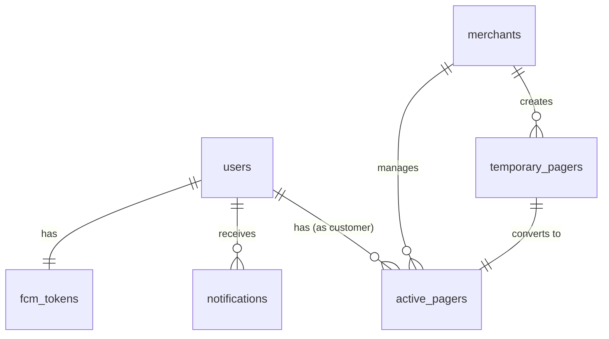

# Firestore Database Schema

## Overview



---

## Collections

### 1. `users`
Menyimpan data user (customer, merchant, guest).

| Field | Type | Required | Description |
|-------|------|----------|-------------|
| `uid` | string | ✅ | Document ID |
| `role` | string | ✅ | `"customer"` / `"merchant"` / `"guest"` |
| `email` | string | ❌ | Email (null for guest) |
| `displayName` | string | ❌ | Nama tampilan |
| `photoURL` | string | ❌ | URL foto profil |
| `authProvider` | string | ✅ | `"google"` / `"guest"` |
| `createdAt` | Timestamp | ✅ | Waktu registrasi |
| `lastLoginAt` | Timestamp | ✅ | Login terakhir |
| `isGuest` | boolean | ❌ | True jika guest user |
| `guestId` | string | ❌ | ID unik guest |
| `deviceId` | string | ❌ | ID device (untuk guest) |
| `expiresAt` | Timestamp | ❌ | Waktu expired (30 hari untuk guest) |

---

### 2. `merchants`
Menyimpan profil bisnis merchant.

| Field | Type | Required | Description |
|-------|------|----------|-------------|
| `businessName` | string | ✅ | Nama usaha |
| `name` | string | ❌ | Nama pemilik |
| *(additional fields)* | - | - | *Custom merchant data* |

---

### 3. `temporary_pagers`
QR Code pager yang belum di-scan customer.

| Field | Type | Required | Description |
|-------|------|----------|-------------|
| `pagerId` | string | ✅ | = Document ID |
| `merchantId` | string | ✅ | Ref ke merchant |
| `number` | int | ✅ | Nomor pager (auto-increment) |
| `randomCode` | string | ✅ | 6-char random (ex: `A3K9M2`) |
| `status` | string | ✅ | Always `"temporary"` |
| `createdAt` | Timestamp | ✅ | Waktu dibuat |
| `expiresAt` | Timestamp | ✅ | 24 jam dari createdAt |
| `label` | string | ❌ | Label custom (ex: "Meja 5") |
| `metadata` | map | ❌ | Data tambahan |

---

### 4. `active_pagers`
Pager yang sudah di-scan dan aktif.

| Field | Type | Required | Description |
|-------|------|----------|-------------|
| `pagerId` | string | ✅ | = Document ID |
| `merchantId` | string | ✅ | Ref ke merchant |
| `customerId` | string | ✅ | Ref ke user yang scan |
| `customerType` | string | ✅ | `"registered"` / `"guest"` |
| `number` | int | ✅ | Nomor pager |
| `queueNumber` | int | ✅ | Nomor antrian (auto-increment) |
| `randomCode` | string | ✅ | 6-char random |
| `status` | string | ✅ | Status enum (lihat di bawah) |
| `createdAt` | Timestamp | ✅ | Waktu dibuat (dari temporary) |
| `activatedAt` | Timestamp | ✅ | Waktu customer scan |
| `scannedBy` | map | ✅ | Info customer: `{name, email?, guestId?}` |
| `label` | string | ❌ | Label custom |
| `notes` | string | ❌ | Catatan dari merchant |
| `invoiceImageUrl` | string | ❌ | URL gambar invoice |
| `ringingCount` | int | ❌ | Berapa kali dipanggil (default: 0) |
| `metadata` | map | ❌ | Data tambahan |

**Status Values:**
```
temporary → waiting → ready → ringing → finished
                           ↘ expired
```

| Status | Description |
|--------|-------------|
| `waiting` | Menunggu pesanan |
| `ready` | Pesanan siap |
| `ringing` | Sedang dipanggil (notifikasi aktif) |
| `finished` | Selesai diambil |
| `expired` | Kadaluarsa |

---

### 5. `notifications`
Histori notifikasi untuk users.

| Field | Type | Required | Description |
|-------|------|----------|-------------|
| `userId` | string | ✅ | Recipient user ID |
| `title` | string | ✅ | Judul notifikasi |
| `body` | string | ✅ | Isi notifikasi |
| `type` | string | ✅ | Enum (lihat di bawah) |
| `data` | map | ❌ | Extra data: `{pagerId, pagerNumber}` |
| `isRead` | boolean | ✅ | Sudah dibaca? (default: false) |
| `createdAt` | Timestamp | ✅ | Waktu dibuat |

**Notification Types:**
- `newCustomer` - Customer baru join
- `orderReady` - Pesanan siap
- `orderCalling` - Dipanggil
- `orderExpiringSoon` - Akan expired
- `orderExpired` - Sudah expired
- `orderFinished` - Selesai

---

### 6. `fcm_tokens`
FCM push notification tokens.

| Field | Type | Required | Description |
|-------|------|----------|-------------|
| *(Document ID)* | string | ✅ | = userId |
| `token` | string | ✅ | FCM token string |
| `updatedAt` | Timestamp | ✅ | Terakhir update (server timestamp) |

---

## Indexes Required

```
Collection: active_pagers
- merchantId ASC, activatedAt DESC
- merchantId ASC, number DESC
- customerId ASC, activatedAt DESC

Collection: notifications
- userId ASC, createdAt DESC
- userId ASC, isRead ASC
```

---

## Security Rules (Recommended)

```javascript
rules_version = '2';
service cloud.firestore {
  match /databases/{database}/documents {
    // Users can read/write their own data
    match /users/{userId} {
      allow read, write: if request.auth.uid == userId;
    }
    
    // Merchants can manage their pagers
    match /temporary_pagers/{pagerId} {
      allow read: if request.auth != null;
      allow write: if get(/databases/$(database)/documents/users/$(request.auth.uid)).data.role == 'merchant';
    }
    
    // Active pagers readable by owner merchant or customer
    match /active_pagers/{pagerId} {
      allow read: if request.auth != null;
      allow write: if get(/databases/$(database)/documents/users/$(request.auth.uid)).data.role == 'merchant';
    }
    
    // FCM tokens - only owner
    match /fcm_tokens/{userId} {
      allow read, write: if request.auth.uid == userId;
    }
    
    // Notifications - only recipient
    match /notifications/{notificationId} {
      allow read, write: if request.auth.uid == resource.data.userId;
    }
  }
}
```
